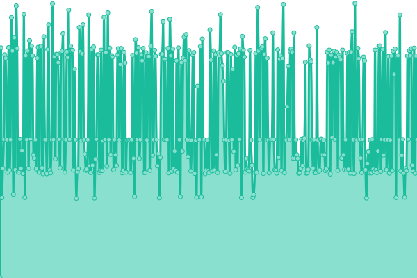
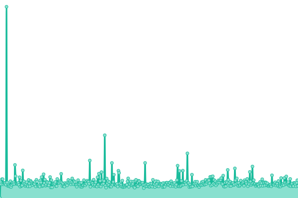
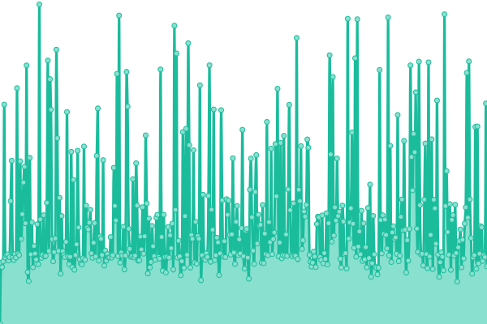
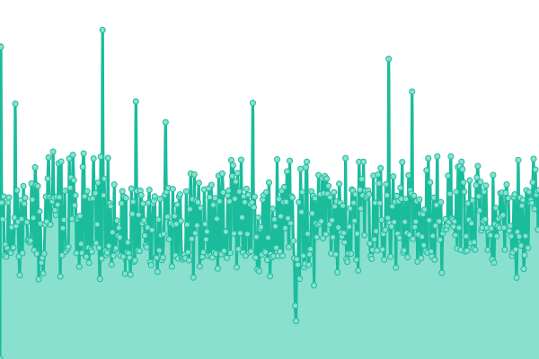
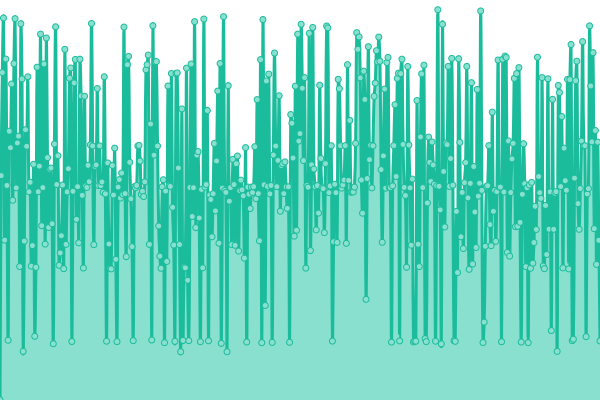
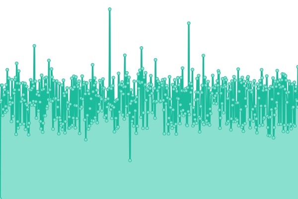

# [📈 Live Status](https://monitor.it.gymall.de): <!--live status--> **🟧 Partial outage**

This repository contains the open-source uptime monitor and status page for [gymall](https://monitor.it.gymall.de), powered by [Upptime](https://github.com/upptime/upptime).

With [Upptime](https://upptime.js.org), you can get your own unlimited and free uptime monitor and status page, powered entirely by a GitHub repository. We use [Issues](https://github.com/gymall/upptime/issues) as incident reports, [Actions](https://github.com/gymall/upptime/actions) as uptime monitors, and [Pages](https://monitor.it.gymall.de) for the status page.

<!--start: status pages-->
<!-- This summary is generated by Upptime (https://github.com/upptime/upptime) -->
<!-- Do not edit this manually, your changes will be overwritten -->
<!-- prettier-ignore -->
| URL | Status | History | Response Time | Uptime |
| --- | ------ | ------- | ------------- | ------ |
|  [IServ](https://gymall.de/iserv/) | 🟩 Up | [i-serv.yml](https://github.com/gymall/upptime/commits/HEAD/history/i-serv.yml) | 

 554ms
     
 | 

<a href="https://gymall.github.io/upptime/history/i-serv">100.00%</a>
    

|  [Moodle](https://moodle.gymall.de/) | 🟩 Up | [moodle.yml](https://github.com/gymall/upptime/commits/HEAD/history/moodle.yml) | 

 2061ms
     
 | 

<a href="https://gymall.github.io/upptime/history/moodle">100.00%</a>
    

|  [Webseite](https://gymnasium-allermoehe.hamburg.de/) | 🟩 Up | [webseite.yml](https://github.com/gymall/upptime/commits/HEAD/history/webseite.yml) | 

 1935ms
     
 | 

<a href="https://gymall.github.io/upptime/history/webseite">100.00%</a>
    

|  [Digitale Kunstgalerie](http://gymnasium-allermoehe.info/) | 🟩 Up | [digitale-kunstgalerie.yml](https://github.com/gymall/upptime/commits/HEAD/history/digitale-kunstgalerie.yml) | 

 720ms
     
 | 

<a href="https://gymall.github.io/upptime/history/digitale-kunstgalerie">100.00%</a>
    

|  [eduPort](https://eduport.hamburg.de/) | 🟩 Up | [edu-port.yml](https://github.com/gymall/upptime/commits/HEAD/history/edu-port.yml) | 

 1635ms
     
 | 

<a href="https://gymall.github.io/upptime/history/edu-port">100.00%</a>
    

|  [LMS](https://lms.lernen.hamburg/) | 🟥 Down | [lms.yml](https://github.com/gymall/upptime/commits/HEAD/history/lms.yml) | 

 880ms
     
 | 

<a href="https://gymall.github.io/upptime/history/lms">100.00%</a>
    

<!--end: status pages-->

[**Visit our status website →**](https://monitor.it.gymall.de)

## 📄 License

- Powered by: [Upptime](https://github.com/upptime/upptime)
- Code: [MIT](./LICENSE) © [gymall](https://monitor.it.gymall.de)
- Data in the `./history` directory: [Open Database License](https://opendatacommons.org/licenses/odbl/1-0/)
